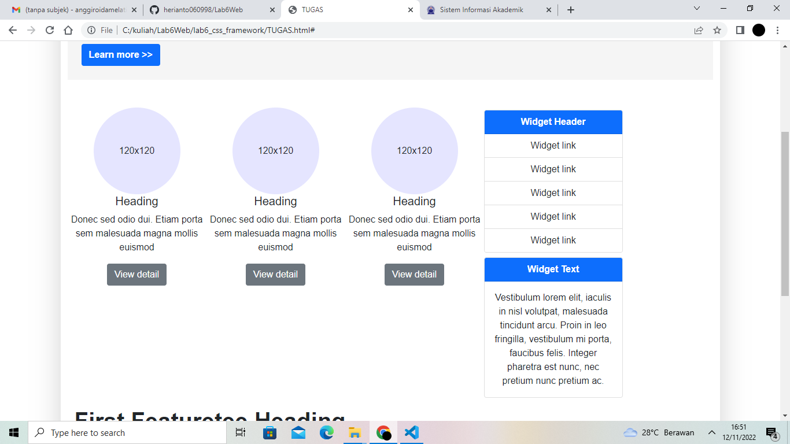

# Lab6Web

# TUGAS 6

| Nama | kelas | Nim | Matkul |
| -- | --- | ---- | ----------- |
| Heri Anto Simamora | TI.21.B.2| 312110365 | Perograman Web |

## MEMBUAT LAYOUT SEDERHANA 

## MEMBUAT NAVIGASI

## MEMBUAT HERO PANEL 

## MEMBUAT SIDE BAR , MAIN , WIDGET

## MENAMBAHKAN CONTENT ARTIKEL

